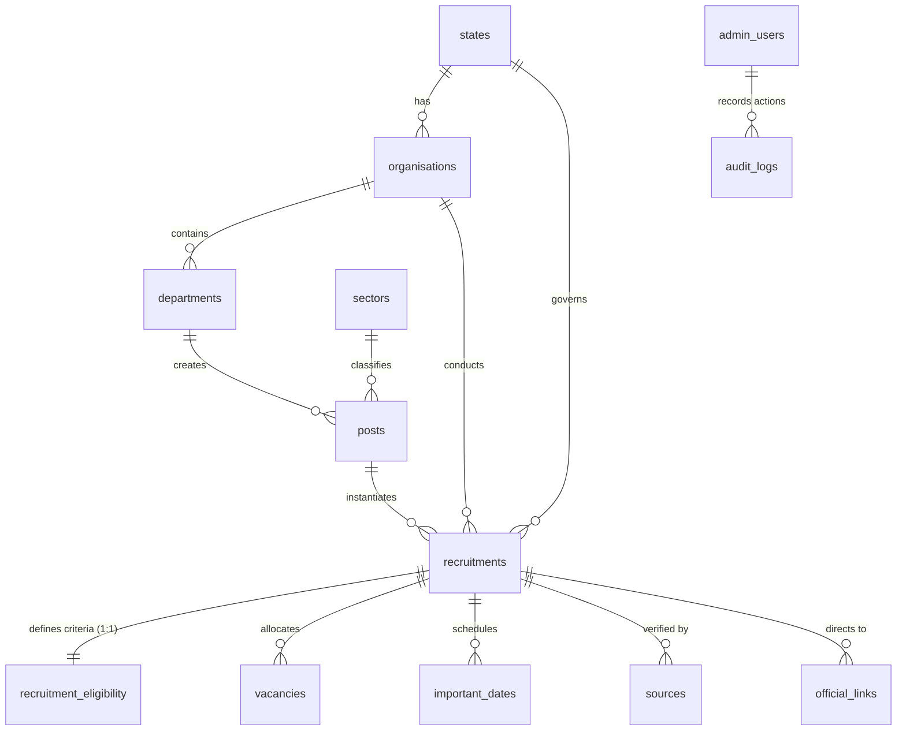

# NIRNAY (RozgarSetu) — Platform Architecture, Backend Data Flow & Pre-Production Audit

**Document Type:** Comprehensive Architecture Audit, Backend Business Logic Map & Pre-Production Readiness Report  
**Date:** September 2026  
**Audited Platform:** NIRNAY (RozgarSetu MP) — Government Job Discovery & Deterministic Eligibility Engine  
**Current Scope:** Madhya Pradesh (Pilot), designed for All-India State Cadre Expansion  
**Runtime:** Cloudflare Workers (SSR) · Cloudflare D1 (SQLite) · Drizzle ORM · Astro 7 · React 19 · Tailwind CSS v4  

---

## Executive Summary & Audit Verdict

NIRNAY is engineered as a deterministic, edge-rendered discovery engine for government employment opportunities. This audit evaluates the complete backend business logic, relational data flow, and runtime constraints **specifically before replacing demonstration data with live government recruitment records**.

### The Verdict:
> ⚠️ **CONDITIONAL READINESS: Safe for Madhya Pradesh ONLY AFTER resolving 4 critical query performance bottlenecks.**

* **The Core Logic is Solid:** The deterministic calculation algorithms, age cutoff math, statutory relaxation rules, duplicate detection, and 6-stage publication validation are **production-grade**. You will not corrupt data or issue erroneous eligibility verdicts.
* **The Query Layer Has Critical Scalability Flaws:** Several single-record queries fetch the entire database into Cloudflare Worker memory before filtering with JavaScript `array.filter()`. If you import 50+ live recruitments with thousands of category vacancies without fixing this, the edge runtime will hit Cloudflare Workers' 128MB RAM limit and D1's 1MB query response size ceiling.

---

## 1. High-Level Platform Architecture & Tech Stack

```
d:\Personal Projects\Eligibility Engine\
├── src/
│   ├── components/
│   │   ├── admin/       (AdminDataTable, AdminSidebar)
│   │   ├── common/      (Header, Footer, DisclaimerBanner)
│   │   └── eligibility/ (EligibilityWizard.tsx)
│   ├── db/
│   │   ├── client.ts    (D1 Drizzle client)
│   │   ├── queries.ts   (Data Access Layer & Dual-Mode Fallbacks)
│   │   ├── schema.ts    (14 SQLite tables & relations)
│   │   └── seed.sql     (Master MP administrative seed)
│   ├── engine/
│   │   ├── eligibility.ts          (Deterministic rule engine)
│   │   ├── batch-eligibility.ts    (Multi-job progressive evaluator)
│   │   └── extract-notification.ts (Rulebook gazette regex extractor)
│   ├── layouts/         (BaseLayout.astro, AdminLayout.astro)
│   ├── lib/             (hostname.ts)
│   ├── middleware.ts    (Subdomain rewrites & CF Zero Trust auth)
│   ├── pages/
│   │   ├── admin/       (Operations console: recruitments, masters, settings)
│   │   ├── admit-cards/ (Admit cards tracker)
│   │   ├── answer-keys/ (Model answer key tracker)
│   │   ├── results/     (Merit list & result tracker)
│   │   ├── jobs/        (Public opportunities catalog)
│   │   ├── recruitments/[slug].astro (Recruitment detail notice)
│   │   ├── posts/[slug].astro        (Canonical cadre career guide)
│   │   ├── organisations/[slug].astro
│   │   ├── sectors/[sector].astro
│   │   ├── calendar.astro, eligibility-checker.astro, search.astro
│   │   └── disclaimer.astro, privacy.astro, terms.astro, source-policy.astro
│   └── services/
│       ├── duplicate-detector.ts    (Fuzzy notice deduplication)
│       ├── lifecycle.ts             (Canonical state machine)
│       └── publication-validator.ts (6-stage publishing guard)
├── migrations/          (0001_init, 0002_detail_content, 0003_lifecycle)
├── astro.config.mjs     (SSR server mode, Cloudflare adapter)
└── wrangler.jsonc       (Worker & D1 binding configuration)
```

* **Core Runtime:** Astro 7.3.3 configured with `output: 'server'` utilizing `@astrojs/cloudflare` adapter running on Cloudflare Workers edge nodes.
* **Component Architecture:** Server-first Astro SSR templates with zero runtime client JS for standard pages. React 19 (`@astrojs/react`) is used selectively as an interactive client-side island (`EligibilityWizard.tsx`).
* **Styling & Design System:** Tailwind CSS v4 (`@tailwindcss/vite`) with curated CSS variables, fluid typography, dark mode tokens, and custom fonts (Outfit, Plus Jakarta Sans, Inter).
* **Database & ORM:** Cloudflare D1 (serverless distributed SQLite at the edge) paired with Drizzle ORM 0.45.2.
* **Edge Routing & Security Middleware:** `src/middleware.ts` routes requests across subdomains (rewriting `admin.*` to `/admin`), verifies Cloudflare Zero Trust identity headers (`cf-access-authenticated-user-email`) in production, and provides local developer bypasses.

---

## 2. Backend Business Logic & Data Flow Map

### 2.1 End-to-End Flow Diagram

```
[Admin Input]
   │
   ├─► (POST /admin/recruitments/new or /edit)
   │     │
   │     ▼
   │   Backend Ingestion Service (src/db/queries.ts)
   │     ├─► duplicate-detector.ts (fuzzy advt/title/URL match)
   │     ├─► publication-validator.ts (6-stage integrity check)
   │     └─► lifecycle.ts (canonical state enrichment)
   │     │
   │     ▼
   │   Cloudflare D1 Transaction via db.batch()
   │     ├─► recruitments
   │     ├─► recruitment_eligibility
   │     ├─► vacancies
   │     ├─► important_dates
   │     ├─► sources
   │     ├─► official_links
   │     └─► audit_logs
   │
   └─► (Admin Masters: /admin/masters)
         └─► updates posts table directly
```
```
[Candidate Request]
   │
   ▼
Edge Middleware (src/middleware.ts)
   │
   ▼
Astro SSR Page Handler (src/pages/*)
   │
   ▼
src/db/queries.ts
   │
   ├─► D1 Bound? ──► Drizzle SQL Query (findMany / findFirst with relations)
   │                      │
   │                      ▼
   │                 mapDbRecruitmentToDetails()
   │                      │
   │                      ▼
   └─► No D1?   ──► In-Memory Mock Arrays (FALLBACK_RECRUITMENTS)
                          │
                          ▼
Public Page Template (/jobs, /recruitments/[slug], /calendar, etc.)
   │
   ▼
Delivered to Candidate Browser
```

### 2.2 Feature-by-Feature Data Flow

1. **Jobs / Recruitments:**
   * **Admin Ingest:** Admin submits form at `/admin/recruitments/new` or `/admin/recruitments/[id]/edit`. Handled by `createRecruitmentAtomic` or `updateRecruitmentAtomic` in `queries.ts`.
   * **Backend Services:** `detectDuplicates()` checks for matching advertisement numbers or gazette URLs; `validateRecruitmentForPublication()` verifies chronological dates and mandatory criteria; `resolveRecruitmentLifecycle()` computes canonical lifecycle state.
   * **Database:** Atomic `db.batch()` writes across `recruitments`, `recruitment_eligibility`, `vacancies`, `important_dates`, `sources`, `official_links`, and `audit_logs`.
   * **Public Read:** `/jobs/index.astro` and `/recruitments/[slug].astro` call `getAllActiveRecruitments()` and `getRecruitmentWithRelations(slug)`.
   * **User:** Receives SSR HTML with category quota tables, verified dates, and gazette links.

2. **Exams:**
   * **Admin Ingest:** Admin enters an examination date string (`examDate`) and selects `examStatus` inside the recruitment form.
   * **Backend Services:** `lifecycle.ts` uses `examDate` and `examStatus` to derive `lifecycleStatus = 'EXAM_SCHEDULED'`.
   * **Database:** Stored as `important_dates` (`eventType = 'EXAM_DATE'`) and on `recruitments.exam_status`. **No `exams` table exists.**
   * **Public Read:** `/calendar.astro` iterates all recruitments and displays `EXAM_DATE` milestones.

3. **Admit Cards:**
   * **Admin Ingest:** Ingested indirectly as a date (`eventType = 'ADMIT_CARD'`) and an official link (`linkType = 'ADMIT_CARD'`).
   * **Backend Services:** No admit card service exists.
   * **Database:** No `admit_cards` table.
   * **Public Read:** `/admit-cards/index.astro` calls `getAllActiveRecruitments()`, runs an in-memory filter (`r.examDate || r.lifecycleStatus === 'ADMIT_CARD_RELEASED'`), and constructs synthetic admit card items.
   * **User:** Clicking an admit card routes to the external recruiting agency portal or `/recruitments/[slug]`.

4. **Answer Keys:**
   * **Admin Ingest:** Handled only as an official link type (`linkType = 'ANSWER_KEY'`) or manual markdown note.
   * **Backend Services:** No answer key service.
   * **Database:** No `answer_keys` table.
   * **Public Read:** `/answer-keys/index.astro` calls `getAllActiveRecruitments()` and maps recruitments where `lifecycleStatus === 'ANSWER_KEY_OUT'` or `resultStatus === 'DECLARED'`.
   * **User:** Displays provisional or final status text with an outbound link to `esb.mp.gov.in`.

5. **Results:**
   * **Admin Ingest:** Admin sets `resultStatus = 'DECLARED'` in the recruitment edit form.
   * **Backend Services:** `lifecycle.ts` prioritizes `resultStatus === 'DECLARED'` to override lifecycle to `RESULT_DECLARED`.
   * **Database:** Stored as `recruitments.result_status` (`'NOT_DECLARED'` | `'DECLARED'`) and optionally an `official_links` row (`linkType = 'RESULT'`).
   * **Public Read:** `/results/index.astro` filters `getAllActiveRecruitments()` where `resultStatus === 'DECLARED'`.
   * **User:** Direct download link pointing to the authority portal scorecard.

6. **Guides / Canonical Posts:**
   * **Admin Ingest:** `/admin/masters/index.astro` executes form actions `create_post` and `update_post` via `createCanonicalPost` and `updateCanonicalPost`.
   * **Backend Services:** Auto-generates post slug.
   * **Database:** Persisted to `posts` table (linked to `departments` and `sectors`).
   * **Public Read:** `/posts/[slug].astro` calls `getCanonicalPostBySlug(slug)`.
   * **User:** Sees pay scale, default qualifications, and active recruitment drives. Syllabus and selection stages are hardcoded in a `switch` statement in the template.

7. **Eligibility Engine:**
   * **Admin Ingest:** Admin defines min/max age, cutoff date, category relaxations, minimum qualification rank, and physical standards in the recruitment editor.
   * **Backend Services:** Saved to `recruitment_eligibility`.
   * **Delivery & Calculation:** `/eligibility-checker.astro` queries all recruitments and serializes their full criteria objects into the client-side bundle. `EligibilityWizard.tsx` executes `evaluateEligibility()` locally in candidate's browser via React `useMemo`.
   * **User:** Profile evaluated instantly in browser into `Eligible`, `Needs Verification`, and `Not Eligible`.

8. **Organisations / Departments / Sectors:**
   * **Admin Ingest:** View-only in UI. Drawer actions in `/admin/departments.astro` and `/admin/organisations.astro` fire browser `alert()` popups with no database calls.
   * **Database:** Initial data loaded via `seed.sql` into `states`, `organisations`, `departments`, `sectors`.
   * **Public Read:** Dynamic routes `/organisations/[slug].astro` and `/sectors/[sector].astro`.

9. **Important Dates & Statuses:**
   * Fully relational child records in `important_dates` and authoritative columns in `recruitments` (`status`, `lifecycle_status`, `exam_status`, `result_status`). Computed on write and verified on read.

10. **Official Sources & Links:**
    * Persisted into `sources` (provenance PDFs, publication dates, verification timestamps) and `official_links` (direct application, syllabus, admit card URLs).

---

## 3. Database Schema, Relationships & Persistence Reality



| Feature | Actual Table(s) in D1 | Foreign Key Relationships | Persistence Reality |
| :--- | :--- | :--- | :--- |
| **Recruitments** | `recruitments` | `post_id -> posts.id`<br>`organisation_id -> organisations.id`<br>`state_id -> states.id` | 🟢 **Properly Persisted** (Full CRUD via atomic batch) |
| **Eligibility Criteria** | `recruitment_eligibility` | `recruitment_id -> recruitments.id` (1:1, CASCADE) | 🟢 **Properly Persisted** (Full atomic write) |
| **Category Vacancies** | `vacancies` | `recruitment_id -> recruitments.id` (1:N, CASCADE) | 🟢 **Properly Persisted** (Saved per quota/gender) |
| **Important Dates** | `important_dates` | `recruitment_id -> recruitments.id` (1:N, CASCADE) | 🟢 **Properly Persisted** (Normalized event dates) |
| **Official Sources** | `sources` | `recruitment_id -> recruitments.id` (1:N, CASCADE) | 🟢 **Properly Persisted** in DB; 🔴 **Admin UI verification is a mock alert** |
| **Official Links** | `official_links` | `recruitment_id -> recruitments.id` (1:N, CASCADE) | 🟢 **Properly Persisted** |
| **Audit Logs** | `audit_logs` | No FK (`admin_email`, `entity`, `entity_id`) | 🟢 **Properly Persisted** on atomic create/update |
| **Canonical Posts** | `posts` | `department_id -> departments.id`<br>`sector_id -> sectors.id` | 🟢 **Properly Persisted** via `/admin/masters` |
| **Organisations** | `organisations` | `state_id -> states.id` | 🟡 **Persisted in DB via seed**; 🔴 **Admin screen is hardcoded mock data** |
| **Departments** | `departments` | `organisation_id -> organisations.id` | 🟡 **Persisted in DB via seed**; 🔴 **Admin "Save" drawer is a mock alert** |
| **Sectors** | `sectors` | Primary key only | 🟡 **Persisted in DB via seed**; No admin CRUD |
| **Exams** | *No table* | Derived from `recruitments.exam_status` & `important_dates` | 🟡 **Derived only** |
| **Admit Cards** | *No table* | Derived from date strings and status checks | 🟡 **Derived / Filtered on the fly** |
| **Answer Keys** | *No table* | Derived from status strings | 🟡 **Derived / Filtered on the fly** |
| **Results** | *No table* | Derived from `recruitments.result_status` | 🟡 **Derived / Filtered on the fly** |
| **SEO Metadata** | *No table* | None | 🔴 **Pure Mock** (`admin/seo.astro` does not save to DB) |

---

## 4. Backend Feature Readiness Scorecard

```
┌────────────────────────────────────────────────────────────────────────────┐
│ 🟢 PRODUCTION-READY                                                        │
├────────────────────────────────────────────────────────────────────────────┤
│ • Core Eligibility Engine (src/engine/eligibility.ts)                      │
│ • Deterministic Age & Cutoff Date Math                                     │
│ • MP Statutory Relaxation Matrix (UR, OBC +3, SC/ST +5, Female up to 38)   │
│ • Atomic Ingestion & Multi-Table Batch Writes (queries.ts)                 │
│ • Publication Validation Guard (src/services/publication-validator.ts)     │
│ • Duplicate Detection Service (src/services/duplicate-detector.ts)        │
│ • Canonical Lifecycle State Resolution (src/services/lifecycle.ts)         │
│ • Cloudflare Edge Zero Trust Auth Middleware (src/middleware.ts)           │
├────────────────────────────────────────────────────────────────────────────┤
│ 🟡 PARTIALLY IMPLEMENTED                                                   │
├────────────────────────────────────────────────────────────────────────────┤
│ • Public Jobs Catalog (Works, but does in-memory filtering instead of SQL) │
│ • Career Guides (Guides exist, but syllabus/stages are hardcoded in Astro) │
│ • Calendar (Derived accurately, but loads entire DB into memory)           │
│ • Admit Cards, Answer Keys, Results (Functional trackers, but no entities) │
│ • Batch Eligibility Engine (100% tested, but orphan / unintegrated in UI)  │
│ • Gazette Notification Extractor (100% tested, but orphan in Admin UI)     │
├────────────────────────────────────────────────────────────────────────────┤
│ 🔴 UI EXISTS BUT BACKEND LOGIC IS MISSING (MOCKS)                         │
├────────────────────────────────────────────────────────────────────────────┤
│ • Admin Source Verification (/admin/sources — alert only, no DB write)     │
│ • Admin Departments (/admin/departments — alert only, no DB write)         │
│ • Admin Organisations (/admin/organisations — hardcoded mock array)        │
│ • Admin Eligibility Rules Builder (/admin/eligibility-rules — alert only)  │
│ • Admin SEO Management (/admin/seo — mock preview, alert only)             │
│ • Admin Documents (/admin/documents — hardcoded mock array)                │
│ • Admin Audit Log View (/admin/audit-log — hardcoded mock array)           │
└────────────────────────────────────────────────────────────────────────────┘
```

---

## 5. Eligibility Engine Deep-Dive

### 5.1 Calculation Mechanics
1. **Age at Cutoff:** Computes candidate age as of the statutory cutoff date (e.g., `2026-01-01`) using fractional year math: `(cutoffDate - dob) / 365.25`.
2. **Statutory Relaxation Stacking:**
   * Baseline max age evaluated against general category limit (`maxAgeGeneral`).
   * Category relaxation added: SC/ST (+5), OBC (+3).
   * Female relaxation: statutory rule `effectiveMaxAge = max(categoryRelaxation, femaleRelaxation)`. Max cap at 38 years.
   * EWS: Strictly 0 years relaxation (per MP state gazettes).
3. **Educational Qualification Hierarchy:** Evaluates rank mapping:
   `8TH (1) < 10TH (2) < 12TH (3) < DIPLOMA (4) < GRADUATION (5) < POST_GRADUATION (6)`.
   Candidate rank must be `>=` required rank.
4. **Degree Stream:** Case-insensitive substring matching against `allowedStreams` array (or `ANY`).
5. **Prerequisites & Physicals:** Evaluates domicile, employment exchange, CPCT scorecard, height, and chest metrics. Missing values evaluate to `UNKNOWN` (`NEEDS_VERIFICATION`) rather than an immediate `FAIL`.

### 5.2 Storage & Hardcoding
* **Storage:** Rules are **database-driven** in `recruitment_eligibility`. When an admin creates or edits a recruitment, these thresholds are persisted in D1.
* **Hardcoded Portions:** The *evaluation logic* in `eligibility.ts` hardcodes MP-specific fields:
  * `requiresMpDomicile` checks `user.isMpDomicile`.
  * `requiresMpEmploymentReg` checks `user.hasMpRojgarPanjiyan`.
  * `requiresCpct` checks `user.hasCpct`.

### 5.3 Performance & Scalability
* **Client Serialization:** In `src/pages/eligibility-checker.astro`, the server calls `getAllActiveRecruitments()` and injects the criteria of **all active recruitments into the HTML as serialized JSON**.
* **Impact:** With 10 demo recruitments, HTML overhead is negligible (~15KB). With 500 real government recruitments, page weight will exceed **1.5MB of raw JSON payload**, causing high Time to Interactive (TTI) on mobile devices.
* **No Serverless API:** There is currently no `POST /api/eligibility/evaluate` endpoint.

### 5.4 Multi-State Expansion for the Engine
* **Core math (Age, Relaxations, Educational Levels, Physical Standards): YES.** This logic is universal across all Indian state and central government recruitments.
* **State Prerequisites: NO.** It requires refactoring `recruitment_eligibility` to replace `requires_mp_*` columns with a generic `prerequisitesJson` array (e.g. `[{ type: "DOMICILE", state: "RJ" }, { type: "EXAM", code: "CET" }]`).

---

## 6. Jobs → Exam → Admit Card → Answer Key → Result Relationship Analysis

### Current Architectural Reality
**Exams, Admit Cards, Answer Keys, and Results ARE NOT independent entities, nor are they child records.**

They are **merely fields, filter conditions, and milestone strings attached to the parent `recruitments` table**:

```
recruitments (Table)
  │
  ├── exam_status (Column: 'NOT_SCHEDULED' | 'SCHEDULED' | 'COMPLETED')
  ├── result_status (Column: 'NOT_DECLARED' | 'DECLARED')
  │
  ├── important_dates (Child Table)
  │     ├── event_type = 'EXAM_DATE'      ──► Rendered on /calendar
  │     ├── event_type = 'ADMIT_CARD'     ──► Filtered on /admit-cards
  │     └── event_type = 'RESULT'         ──► Filtered on /results
  │
  └── official_links (Child Table)
        ├── link_type = 'ADMIT_CARD'      ──► Outbound URL
        ├── link_type = 'ANSWER_KEY'     ──► Outbound URL
        └── link_type = 'RESULT'          ──► Outbound URL
```

### Consequences:
1. **Single-Tier Assumption:** A recruitment can have multiple tiers (e.g., MP Police Constable has Written CBT, Physical Proficiency Test, and Document Scrutiny). Under the current schema, there is only one `exam_status` and one `result_status`.
2. **No Deep Detail Pages:** `/admit-cards`, `/answer-keys`, and `/results` have no `[slug].astro` pages. Candidates cannot bookmark or share a direct result page; they are redirected back to the root recruitment or external portal.
3. **No Cutoff Marks or Roll Number Storage:** Cutoff marks and qualified candidate merit lists cannot be stored structurally; they must be linked as raw third-party PDFs.

---

## 7. Performance & Query Profiling

### 7.1 In-Memory Filtering (Missing SQL `WHERE`, `LIMIT`, `OFFSET`)
* **Location:** `src/pages/jobs/index.astro`, `src/pages/calendar.astro`, `src/pages/search.astro`.
* **Problem:** Every request to `/jobs` calls `getAllActiveRecruitments()`, which fetches **every single published recruitment in the database** with 4 relational joins (`post`, `organisation`, `eligibility`, `importantDates`). Filtering by qualification, organization, and status is executed **in Node.js / V8 memory via `array.filter()`**.
* **Failure Point:** Once real data exceeds 200 recruitments, query execution time will exceed Cloudflare Workers' 50ms CPU limit.

### 7.2 Massive Sub-Query Duplication (Whole-DB Fetching on Single Pages)
* **Location:** `src/db/queries.ts` (`getOrganisationBySlug` and `getCanonicalPostBySlug`).
* **Code:**
  ```typescript
  // In getCanonicalPostBySlug (queries.ts:1873-1877)
  const posts = await getAllCanonicalPosts(providedD1); // Fetches ALL posts
  const allRecruitments = await getAllActiveRecruitments(providedD1); // Fetches ALL recruitments
  ```
* **Problem:** To display **one post guide** (e.g. `/posts/mp-police-constable`), the server queries all posts, all active recruitments, and all associated joins, then filters them in memory.
* **Failure Point:** Visiting `/posts/mp-police-constable` transfers the entire database state into memory for a single page view.

### 7.3 Missing Foreign Key Database Indexes
* **Location:** `src/db/schema.ts` lines 157–175 & `migrations/0001_init.sql`.
* **Problem:** Tables `sources` and `official_links` have foreign keys to `recruitment_id`, but **neither has an index on `recruitment_id`**.
* **Impact:** Every call to `getRecruitmentWithRelations` executes a full table scan on `sources` and `official_links`.

### 7.4 Cloudflare D1 Limits & Edge Worker Ceiling
* **D1 Query Response Limit:** 1MB maximum payload per query response. Fetching all recruitments with full joins will cross this threshold under live production data.
* **Worker RAM:** Cloudflare Workers enforce a strict 128MB memory ceiling. Loading entire catalogs into memory across concurrent requests risks Out-Of-Memory (OOM) worker restarts.

---

## 8. Multi-State Readiness

### Genuine Architectural Blockers (Must Fix for Multi-State)
1. **Coupled DB Columns:** `recruitment_eligibility` has explicit columns:
   * `requires_mp_domicile`
   * `requires_mp_employment_reg`
   * `requires_cpct`
   Adding Rajasthan requires `requires_rj_domicile`, `requires_cet`, `requires_rscit`. Adding UP requires `requires_up_pet`, `requires_ccc`. Schema columns cannot scale across 28 states.
2. **Flat URL Space:** Routes `/jobs` and `/recruitments/[slug]` have no state namespace. Slugs like `/recruitments/police-constable-2026` will collide between MP and Rajasthan.
3. **Hardcoded State Ingestion:** `createRecruitmentAtomic` in `queries.ts` (line 2471) hardcodes `stateId: 'st_mp'`.

### Non-Blockers (Can Safely Wait for Later Phases)
1. **Subdomain Tenancy:** Running `mp.nirnay.in` vs `rj.nirnay.in` is not required immediately; path routing (`/mp/jobs`, `/rj/jobs`) is sufficient.
2. **Bilingual Switcher:** Public site language toggling (Hindi/English) can be deployed incrementally.
3. **State-Specific Automated Scrapers:** Initial data for new states can be ingested via the Admin OPS UI before writing automated web scrapers.

---

## 9. Pre-Production Backend Upgrade Plan

| Action Item | Classification | Rationale |
| :--- | :---: | :--- |
| **Add Foreign Key Indexes to `sources` & `official_links`** | 🚨 **MUST FIX NOW** | Missing indexes cause full table scans on every single detail page load (`recruitments/[slug]`). |
| **Fix Single-Entity Queries (`getPostBySlug`, `getOrgBySlug`)** | 🚨 **MUST FIX NOW** | Stop fetching the entire database of recruitments just to display one post guide or organization page. |
| **Add SQL Pagination / Server-side Filters to `/jobs`** | 🚨 **MUST FIX NOW** | In-memory `array.filter()` will fail Cloudflare Workers 128MB RAM and D1 1MB payload limits under real data volume. |
| **Unify Lifecycle Status Strings** | 🚨 **MUST FIX NOW** | Add `ADMIT_CARD_RELEASED`, `ANSWER_KEY_OUT` to `CanonicalLifecycle` so public filters don't check mismatched strings. |
| **Wire Admin Source Verification to D1** | 🚨 **MUST FIX NOW** | Currently a mock `alert()`. Real data requires an immutable record of verification date and admin email in `sources` and `audit_logs`. |
| **Create Missing Catalog Indexes (`/organisations`, `/posts`)** | 🚨 **MUST FIX NOW** | Prevents 404 errors when users click breadcrumbs or navigation links. |
| **Decouple MP Columns to Generic Prerequisites** | ⏳ **CAN WAIT** | Safe to use existing schema for MP real data. Refactor before importing State #2 (Rajasthan). |
| **Decompose Recruitment into Relational `recruitment_stages`** | ⏳ **CAN WAIT** | Single-tier recruitments can operate with current `important_dates` and `official_links` for initial launch. |
| **Create Serverless API `POST /api/eligibility/evaluate`** | ⏳ **CAN WAIT** | Client-side serialization works for the initial ~30–50 MP recruitment notices. |
| **Cloudflare R2 PDF Archival Bucket** | ⏳ **CAN WAIT** | Can link official government URLs initially; add R2 archival in Phase 2. |
| **Automated Scheduled Scrapers & Cron Workers** | ⏳ **CAN WAIT** | Real data can be manually verified and ingested via Admin OPS UI. |
| **Core Deterministic Math Engine (`eligibility.ts`)** | 🛡️ **ALREADY SUFFICIENT** | 100% verified, production-grade age calculation, relaxation stacking, and qualification hierarchies. |
| **Duplicate Detection Service (`duplicate-detector.ts`)** | 🛡️ **ALREADY SUFFICIENT** | Robust fuzzy matching on advt numbers and titles prevents accidental double entries. |
| **Publication Validation Pipeline (`publication-validator.ts`)** | 🛡️ **ALREADY SUFFICIENT** | 6-stage validation rules prevent publishing incomplete or malformed notices. |

---

## 10. Actionable Pre-Import Checklist

Before running `INSERT` statements with real Madhya Pradesh government vacancy data:

1. [ ] **Execute Index Migration:**
   ```sql
   CREATE INDEX IF NOT EXISTS idx_sources_rec ON sources(recruitment_id);
   CREATE INDEX IF NOT EXISTS idx_links_rec ON official_links(recruitment_id);
   ```
2. [ ] **Patch `getCanonicalPostBySlug` in `src/db/queries.ts`:**
   Replace whole-DB fetch with a direct join or scoped query (`WHERE post_id = ?`).
3. [ ] **Patch `getOrganisationBySlug` in `src/db/queries.ts`:**
   Replace whole-DB fetch with a direct join or scoped query (`WHERE organisation_id = ?`).
4. [ ] **Add SQL-Level Filtering & Limit to `getAllActiveRecruitments`:**
   Support passing optional `where` conditions (e.g. status, qualification) directly to Drizzle instead of filtering in memory.
5. [ ] **Wire `/admin/sources` to execute a D1 `UPDATE` statement** so verified gazettes store genuine audit timestamps.
